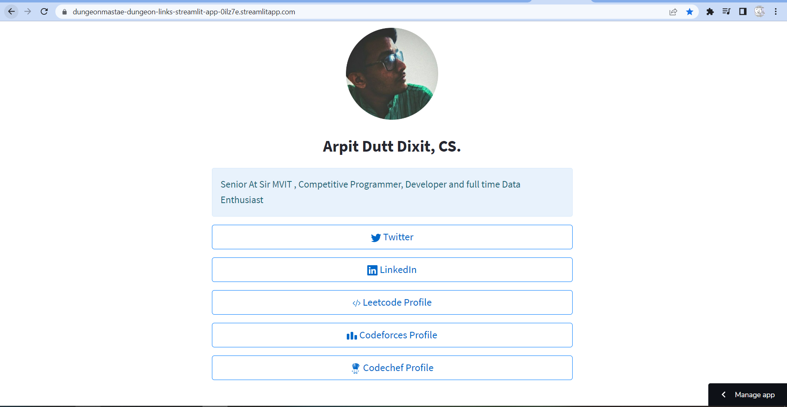

# Welcome to Streamlit `links page`

> A Streamlit app that you can build for free to store all your personal links that is similar in functionality to that of [Linktr.ee](https://linktr.ee/).



# Demo app

[](https://dungeonmastae-dungeon-links-streamlit-app-0ilz7e.streamlitapp.com/)

# Setting up

Getting your own Streamlit `links page` up and running is really easy, just follow the following 3 steps:

**Step 1**. [Click here](https://github.com/dataprofessor/links/generate) to generate a copy of this repository. Next, name your new repository to anything you'd like except for `your username`.github.io

**Step 2**. Customize the contents of the newly generated `links page` by editing the `streamlit_app.py` file:

```python
import streamlit as st
from st_functions import st_button, load_css
from PIL import Image

load_css()

col1, col2, col3 = st.columns(3)
col2.image(Image.open('sJyjnYUx_400x400.png'))

st.header('Arpit Dutt Dixit, CS.')

st.info('Senior At Sir MVIT , Competitive Programmer, Developer and full time Data Enthusiast')

icon_size = 20


st_button('twitter', 'https://twitter.com/arpitDi3496', 'Twitter', icon_size)
st_button('linkedin', 'https://www.linkedin.com/in/arpit-dutt-dixit-59b631121/', 'LinkedIn', icon_size)
st_button('leetcode', 'https://leetcode.com/arpitdixitc23/', 'Leetcode Profile', icon_size)
st_button('codeforces', 'https://codeforces.com/profile/ashwathamaa', 'Codeforces Profile', icon_size)
st_button('codechef', 'https://www.codechef.com/users/arpit121', 'Codechef Profile', icon_size)
```

There are 3 key information that you can modify:
1. `st.header(A)` is used for specifying your name in place of **A**.
Example:
```python
st.header('Arpit Dutt Dixit, CS.')
```

2. `st.info(B)` is used for speciying a quick description about who you are, what you do, etc. in place of **B**.
Example:
```python
st.info('Senior At Sir MVIT , Competitive Programmer, Developer and full time Data Enthusiast')
```

3. `st.button(D, E, F, G)` is a custom function for creating link buttons where **D** represents the icon to display (use `youtube` if the play button is to be displayed), **E** represents the URL, **F** represents the message to display on the clickable button and **G** represents the icon size.
Example:
```python
st_button('codeforces', 'https://codeforces.com/profile/ashwathamaa', 'Codeforces Profile', icon_size)
```

**Step 3**. Deploy to [Streamlit Cloud](https://streamlit.io/cloud). Log-in and click on the **New app** button. Choose the newly generated repo from Steps 1-2. Finally click on the **Deploy!** button. 

After a few moments your new `links page` should be accessible at https://share.streamlit.io/{your-username}/{newly-created-repo}

In an upcoming release of Streamlit Cloud, you will be able to customize the URL address to https://{custom-name--here}.streamlitapp.com/ such as the one that I've created at https://chanin.streamlitapp.com/
